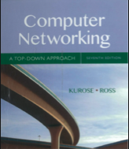

# Computer Networking: A Top-Down Approach book summary

## Overview
- The internet consists of the edge and the core. The edge consisting of end systems (mobile phones, PCs, etc.) and core being the infrastructure that interconnects it all
- Internet is delivered to homes through several physical mediums, like DSL (copper phone wire), Coaxial (TV cable) and optical (glass fibre).
- Protocols are defined by the IETF through RFC (request for comments)
- Homes are connected to access networks (low-tier ISPs) through modems and intermediary splitters
- Packet switching and circuit switching are methods of digital communication. Packet switching hardware is able to receive data through packets from different senders. Packets are processed from multiple links, allowing simultaneous communication over the link. Circuit switching reserves a circuit, i.e. physical connection from one party to another. E.g. traditional phone networks worked this way. This ensures bandwidth but is inefficient with lots of idle time. Circuit switching may use time division multiplexing (allocating time slots) or frequency division multiplexing (allocating frequencies).
- The internet consists of a structure of ISPs. Tier-1 ISPs are connected through internet exchange points. Lower level ISPs may peer and and interconnect or connect to tier-1 ISP.
- Content networks such as Google may have large private networks and connect directly through IXPs or to lower level ISPs (settlement free)
- Packet switching hardware works often through store-and-forward. It receives packets and forwards it. This results in delays. Nodal delay (total delay) consists of processing delay (inspecting packets), queuing delay (packets waiting in the packet queue), transmission delay (max throughput of the device) and propagation delay (time to travel of the sending medium)
- Packet loss occurs when the queue is full and packets are dropped because of it
- The internet protocol stack consists of five layers: physical layer (wire), link layer (ethernet, wifi), network layer (IP), transport layer (TCP/UDP) and application layer (SMTP, HTTP)
- Application layer: message, transport layer: segment, network layer: datagram, link layer: frame
- Packet switching was invented by DARPA, creating DARPAnet. In 1983 TCP/IP became the standard protocol for ARPAnet (many were connected to it by then). In the 1990s Tim Berners Lee invented the internet with an initial version of HTTP, a web server and a browser. Netscape and Microsoft raced to make the best browser. Microsoft won. Many startups start building internet applications. Homes globally got more and more broadband internet access. Wireless devices overtake wired devices. Massive networks on top of internet such as Facebook are created. Companies shift to cloud computing.

## Application layer
- HTTP, SMTP, POP and DNS are all examples of application-layer protocols
- DNS works through a hierarchical structure of DNS servers including root, TLD and authoritative DNS servers.
- A DNS query may be resolved iteratively or recursively by the name server
- DNS queries are cached by intermediary DNS servers, such as a local DNS server
- DASH (Dynamic Adaptive Streaming over HTTP) is used by Netflix and allows clients to download videos in different bitrates as defined by a manifest

## Transport layer
- The transport layer is linked to an application through sockets. A socket is addressed with a port. The transport layer is abstracted in this way and an application can trust the socket to deliver messages through it.
- The transport layer can provide multiple services, with a minimum of multiplexing and demultiplexing
- Demultiplexing is delivering (splitting) the data in a transport-layer segment to the correct socket. Multiplexing is combining the data from multiple sockets and passing it to the network layer
- TCP is connection-oriented. Before exchanging data a handshake procedure establishes a connection between two sockets. Afterwards the connection should be torn down.
- TCP enables reliable transfer; it verifies segments are delivered.
- TCP provides congestion control
- UDP is connectionless, without handshaking and doesn’t provide delivery guarantee or congestion control.
- UDP demultiplexes signals by destination IP and port. TCP demultiplexes by source IP, port, destination port (multiple sockets per port possible)
- Since UDP has no congestion control it can flood links
- UDP and TCP provide error checking by checking the checksum over the data
- TCP does a three-way handshake initialising state variables and communicating (random) start sequence numbers. It uses the SYN bit in the TCP segment. A common attack is SYN-flooding where senders only send the first segment, overwhelming the server with initialised but unused connections.
- The maximum amount of data in a segment is Maximum Segment Size (MSS), on its own determined by the maximum transmission unit (MTU).
- TCP uses sequence numbers (based on a segment’s byte offset) to identify individual segments
- TCP signals out of order or a missing segment by sending a duplicate ACK for the last correctly received segment
- When the receiver receives three duplicate ACKs, it triggers a fast retransmission of the lost packet. Three duplicate ACKs are a strong indicator of a lost packet (e.g. 1-3-4) instead of being out of order (e.g. 1-3-2)
- A timeout determined by recent RTTs also triggers a retransmission of a segment
- TCP works with cumulative acknowledgements, where ACKs for a certain sequence number signals all sequence numbers before were retrieved as well
- TCP uses pipelining: it sends multiple segments simultaneously at a certain rate constrained by windows
- TCP implements flow control to limit outgoing segments to receivers based on their remaining buffer size. Receivers signal their receive window in segments sent to the sender.
- TCP implements end-to-end congestion control to fairly distribute output over connections. It adjusts the congestion window continuously. The window starts at 1 MSS (slow start) and is increased exponentially until packet loss occurs, determining the threshold. The window is then halved and grows exponentially until the threshold is reached after which it grows linearly (1 MSS per RTT) until packet loss happens and the process starts again. This behaviour results in a saw-toothed output rate when plotted
- Many applications use multiple TCP connections to achieve higher output
- Link-layer hardware may indicate congestion as a flag in TCP segments
- New transport-layer protocols are developed to provide other services. For example QUIC, implemented in Chrome browser is based on UDP but implements reliability via retransmission and rate-based congestion control in the application layer

## Network layer
- The network layer can be subdivided in the data plane and control plane. The data plane refers to the forwarding table in the routing devices and the control plane, operating based on packet headers. Control plane refers to routing algorithms that determine the values in the forwarding tables.
- With Software Defined Networking (SDN), the control plane is remote and forwarding tables are updated remotely
- The network layer provides a best-effort delivery, doing no guarantees
- Routers perform a match-plus-action, where matching is matching the datagram to a certain rule and action is e.g. forwarding or dropping
- Forwarding refers to the process of transferring a packet from an input link interface to the appropriate output link interface. Routing is the network-wide process that determines the end-to-end path that packets take from source to destination.
- A router is connected to a link through an interface. It’s this interface that is associated with an IP address
- A router can switch packets (from input port to output port) via memory switching, switching via bus or switching via an network of buses that is nonblocking
- Routers have buffers at input and output ports that can be full and cause packet loss
- A router may use a packet scheduler to choose from which port of the queued packets to transmit. Fair Weighted Queuing picks a queue uniformly, influenced by the associated queue weight
- IPV4 supports fragmentation. If a datagram is too big, a router may fragment a datagram into two fragments which are datagrams with certain flags set. These datagrams are reassembled at the receiving host.
- A network may consist out of subnets, defined by a subnet mask.
- Classless Interdomain Routing (CIDR) generalises the notion of subnet addressing. E.g. a.b.c.d/x where x defines the number of bits that makes up the prefix for all hosts in that subnet. This is classless because classful addressing only allows 8, 16 and 24 subnet addresses which is problematic for the global amount of devices
- An IP address is a 32-bit address. xxx.xxx.xxx.xxx is a numeric representation of the 4 bytes of address information in an IP address.
- ISPs are assigned subnets to assign IPs in, with ICANN overseeing global subnet allocation
- A datagram with address 255.255.255.255 sends a message to all hosts on the same subnet
- DHCP (Dynamic Host Configuration Protocol) provides hosts with an IP address. It works over UDP on port 67. A client sends a broadcast DHCP discover message. The server responds with an address, the DHCP offer. The client then sends a DHCP request message with this address which the server then ACKs.
- Network Address Translation (NAT) is when a router hides a private network behind one public IP address. The router rewrites datagrams by changing the internal IP to the external IP and by changing the port to a random port in the NAT translation table
- IPv6 provides 128 bit addressing vs 32 bit addressing of IPv4. It doesn’t support fragmentation and doesn’t have checksums (assumes end-to-end verification).
- IPv6 works with IPv4 through tunnelling; it encapsulates IPv6 datagrams as a traditional IPv4 datagram and sends it through all IPv4 hosts as a tunnel. When it reaches the next IPv6 host it is decapsulated into an IPv6 datagram.
- With generalised forwarding, each packet switch has a match-plus-action that is computed and distributed by a remote controller
- OpenFlow is a protocol that operates between an SDN controller and an SDN-controlled switch. Flow forwarding tables support multi-level matching, i.e. based on link, network and transport layer headers. It also updates the controller about link-state changes
- There are two common types of routing algorithms: centralised and decentralised. Neither is a clear winner and both are used.
- The link-state routing algorithm is a centralised routing algorithm where each node has a complete view of the network. It is often implemented using Dijkstra’s algorithm for least-cost path computation. Each node broadcasts packets updating other nodes about its neighbours, based on which the nodes update their topology
- The distance vector algorithm is a decentralised algorithm where each node communicates only with its neighbours. It computes the distance vector (least-cost path) for all possible destination nodes using the cost of its own links and its neighbours distance vectors.
- Scale and administrative issues of the internet are resolved by organising routers into autonomous systems (ASs). An ISPs routers are a single AS, or multiple interlinked ASs (for tier-1 ISPs). AS numbers (identifiers) are assigned by ICANN. Routers within an AS run the same routing algorithm.
- The Open Short Path First (OSPF) algorithm is an intra-AS routing algorithm that uses Dijkstra and flooding (broadcasting) of link-state information to compute a graph with shortest paths to all subnets on each node.
- Border Gateway Protocol (BGP) is the inter-AS routing protocol used to route among ISPs. It allows an AS to advertise its subnets to the other ASs. BGP routers construct forwarding tables based on either shortest path or other local preferences/policies.
- The Internet Control Message Protocol (ICMP) is used by hosts and routers to communicate network-layer information, mostly error reporting. ICMP lies just above IP; it doesn’t have a port number and is often supported by the operating system (i.e. not a server process).
- Traceroute is implemented using ICMP. It sends UDP segments to random port with an increasing TTL. The different hops then respond with an ICMP error message.
- Simple Network Management Protocol (SNMP) is a protocol used for getting/setting information from managed network devices’ Management Information Database (MIB). A managing server communicates with an agent running on a device.

## Link layer
- The link layer provides framing (encapsulating), addressing (MAC) and error detection/correction (CRC)
- Most link layer operations are performed by a host’s network adapter (NIC)
- Cyclic Redundancy Check (CRC) is used by ethernet adapters to perform error detection/correction on a bit level
- Ethernet and Wireless LAN are examples of broadcast links. All connected nodes share the same single broadcast channel
- Because all nodes use the same channel, broadcast links have a multiple access problem, and communication needs to be coordinated in order not to collide
- Carrier Sense Multiple Access with Collision Detection (CSMA/CD) is an example of a random access protocol and used in the Ethernet standard. If an adapter senses that the channel is idle it starts to transmit the frame or waits if it’s busy. It aborts if another adapter starts transmitting and tries again after a random delay using (binary) exponential backoff.
- Every network adapter (or network interface) has a MAC address. Ethernet and 802.11 use 6 byte addresses, often represented by its hexadecimal value (xx:xx:xx:xx:xx:xx). Distribution of MAC addresses is done by IEEE which sells address spaces for a nominal fee.
- Address Resolution Protocol (ARP) is used for IP/MAC translation within the same subnet. An ARP query packet is a packet containing the IP to resolve with the MAC broadcast address (FF:FF:FF:FF:FF:FF). The matching adapter responds with an ARP packet with its MAC address. The sender maintains an ARP table to keep track of the IP/MAC pairs and uses it to address link-layer frames.
- Frames addressed outside of the subnet will be sent to the default gateway where the datagram will be extracted and forwarded using a forwarding table
- Several ethernet standards exist, specifying different speeds (100 Mpbs, 1 Gbps) and mediums (twisted pair, fibre)
- Switches differ from hubs in that they do not repeat signals over its ports but instead forward frames using a switch table. When a frame comes in it records the sender’s MAC address along with the interface (switch port) in the switch table. Next time it receives a frame for that MAC address it forwards it to the previously recorded port. A switch is thus self-learning and plug-and-play.
- Virtual LANs (VLANs) are used to isolate parts of a physically connected LAN. They limit the scope of broadcast messages (DHCP, ARP) and thereby improve LAN performance and security. It also allows for more efficient use of switches (one switch is needed instead of several).
- VLAN trunking is used to connect two VLANs. Ethernet frames are tagged with a VLAN tag. Routers/switches then know where to forward the frame to (while keeping the broadcast isolation benefit).
- Data center networks consist of a hierarchy of switches and routers. Each server rack has a Top of Rack (TOR) switch, often 40 Gbps. These are connected to tier-2 switches, which are connected to tier-1 switches connected to a load balancer and an access router. The whole data centre is connected through a border router. Switches are crossconnected to ensure high host-to-host capacity (for applications running spread over hosts).

## Wireless and mobile networks
- IEEE 802.11 wireless LAN (WiFi) is the collection of standards (b,a,g,n,ac) with common characteristics
- A typical home network consists out of a router and several access points. An access point is a level-1 switch (unaware of IP) and simply serves as one hop to the router in the network
-  In 802.11, AP’s periodically send beacon frames. A wireless device scans the 11 channels for these frames for discovery. A device can also perform active scanning, by broadcasting a probe frame to all AP’s. The AP’s will respond with a beacon frame
- 802.11 uses CSMA/CA (Carrier Sense Multiple Access with Collision Avoidance), meaning that each station senses the channel before transmitting and refrains from transmitting (setting a timer with exponential backoff) when the channel is busy. Where ethernet uses Collision Detection (aborts transmission when another another station starts transmitting), 802.11 uses Collision Avoidance. This is because when a receiver detects a signal, the other station may have already quit transmitting, causing unnecessary delays. When a 802.11 station starts transmitting, it thus transmits the entire frame.
- To deal with unreliability of wireless communication, 802.11 uses ACKs to signal a lost frame and cause a retransmission.
- 802.11 uses CRC to detect bit errors
- An 802.11 frame has four MAC address fields, instead of two as with ethernet. Most notably, it uses a third address to send a frame from a device to an AP to the router. The router adds its MAC address to the 802.11 frame when transmitting frames. In this way an AP knows which MAC to address the frame to to send it to the router.
- 4G has an all-IP (also for voice) core network where control plane and data plane are separated and IP datagrams are forwarded over a 4G-internal IP network to the external internet.
- LTE uses a combination of frequency devision multiplexing and time division multiplexing on the downstream channel. By being allocated more time slots, a mobile node is able to achieve increasingly higher transmission rates.
- Retaining an IP is important for connection-oriented applications. A TCP connection only survives if the src/dest IP stays the same. Mobile IP is a protocol for transferring an IP from network to network. It is used for 3G and involves the home agent with the device’s permanent address to route traffic to the foreign agent on the visited network where the device has a COA (care-of address).

